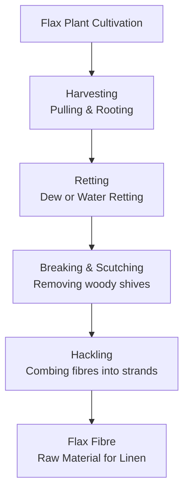
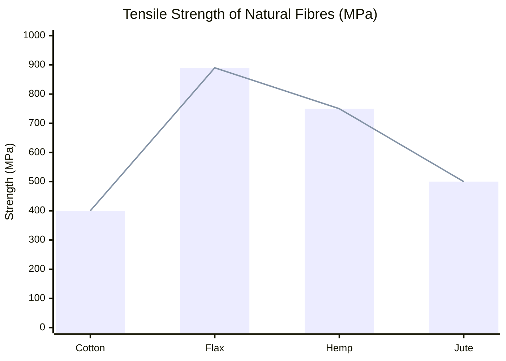

# 🌿 Flax Fibre: The Ancient Bast Fibre

**Task: Fibre Introduction**  
**Chosen Fibre: Flax Fibre** (one of the top natural bast fibres)

> **Overview:** Flax (*Linum usitatissimum*) is one of the oldest cultivated crops in human history, with archaeological evidence dating back over 8,000 years. Primarily grown for its fibres (used to make linen) and its seeds (used to produce linseed oil). Known for its strength, breathability, natural luster, and sustainability, flax is a premium textile fibre and an outstanding eco-friendly alternative to synthetic composites and glass fibre.

---

## 1. Source

Flax is a **bast (stem) fibre**. Unlike cotton, which comes from the seed pod, flax fibres are extracted from the stalk or stem of the plant.

### The Plant & Cultivation
- **Botanical Name:** *Linum usitatissimum* (meaning "most useful").
- **Climate:** Temperate regions with cool, moist growing seasons. Plants reach 80–120 cm height in 90–120 days.
- **Major producers:** Russia, Kazakhstan, India, Canada, France, Belgium, and Poland (European flax is prized for superior quality).
- **Harvesting:** The plant is **pulled** (not cut) by the roots to maximise fibre length. Harvest occurs when stems turn golden but before seeds fully ripen.

### Extraction Process (From Plant to Fibre)
The process of turning the flax plant into spinnable fibre is labor-intensive. The most critical step is **Retting**, where pectins (glue-like substances) binding the fibres to the woody core are broken down.

**Detailed steps (Retting & Scutching):**  
1. **Retting** — Dew retting (field exposure) or water retting (tanks/ponds).  
2. **Drying & Breaking** — Stems are dried and crushed.  
3. **Scutching** — Beating removes woody shives.  
4. **Hackling** — Combing aligns long fibres (line flax) from short fibres (tow).

### Visual: Flax Plant Structure

*Blue-flowered flax plant ready for harvest.*

---

## 2. Properties

Flax fibre combines excellent mechanical performance with natural comfort and sustainability. It is stronger than cotton but less elastic.

### A. Physical Properties
| Property      | Description                          | Impact on Use                  |
|---------------|--------------------------------------|--------------------------------|
| **Length**    | Long staple fibres (20–150 mm)       | Allows smooth, fine yarns      |
| **Color**     | Natural pale blonde to light grey    | Gives linen its characteristic hue |
| **Lustre**    | High natural sheen (waxy surface)    | Creates luxurious premium look |
| **Flexibility**| Low (stiffer than cotton)           | Fabric wrinkles easily         |

### B. Mechanical & Chemical Properties
| Property              | Value/Characteristic          | Detail |
|-----------------------|-------------------------------|--------|
| **Tensile Strength**  | Very High (500–900 MPa)       | Stronger wet than dry          |
| **Tenacity**          | 6.5–8 g/denier                | Stronger than cotton           |
| **Elongation at Break**| Low (1.8–3%)                 | Crisp fabric, low elasticity   |
| **Moisture Regain**   | High (~12%)                   | Absorbs moisture quickly without feeling wet |
| **Thermal Conductivity**| High                        | Feels cool to the touch        |
| **Density**           | 1.4–1.5 g/cm³                 | Lighter than glass fibre       |
| **Young’s Modulus**   | 50–70 GPa                     | Excellent stiffness            |

### Chemical Composition
| Component     | Percentage (%) |
|---------------|----------------|
| Cellulose     | 65–75          |
| Hemicellulose | 15–25          |
| Lignin        | 5–15           |
| Pectins       | 1–5            |
| Ash/Others    | 1–3            |

### Data: Strength Comparison (Approximate Tensile Strength)

*Flax demonstrates significantly higher tensile strength than cotton and jute.*

---

## 3. Uses

Flax fibre is versatile, serving both high-end fashion and heavy industrial sectors.

### 🧵 Textile Applications (Linen)
- **Apparel:** Summer clothing, suits, dresses, and underwear (excellent breathability and cooling effect).
- **Home Textiles:** Bed sheets, tablecloths, napkins, towels, curtains, and upholstery. Linen improves with washing, becoming softer.
- **Canvas & Geotextiles:** Heavy-duty fabrics for sails, tents, fishing nets, ropes, and sewing thread.

  
*Close-up of natural linen fabric showing its characteristic texture and lustre.*

### 🏗️ Industrial & Technical Applications (Composites)
With the rise of eco-friendly engineering, flax is replacing glass fibre in composites:
- **Automotive Interiors:** Door panels, dashboards, and trunk liners (used by BMW, Mercedes, etc.).
- **Sports Equipment:** Bicycle frames, tennis rackets, skis (excellent vibration dampening).
- **Construction:** Thermal/sound insulation panels, fibreboards, and eco-friendly building materials.

### 💰 Currency & Paper
- **Banknotes:** High-quality linen paper blends (e.g., Euro and US Dollar) for superior durability.
- **Other:** Cigarette paper, high-quality stationery, and ropes/twine.

---

## 4. Sustainability & Environmental Impact

Flax is considered one of the most sustainable fibres:
1. **Low Water & Pesticide Usage:** Requires significantly less water and pesticides than cotton.
2. **Biodegradability:** 100% biodegradable and recyclable.
3. **Near-Zero Waste:** Every part of the plant is used:
   - *Stalk* → Fibre (textiles/composites)
   - *Seeds* → Linseed oil (paints, varnishes, food)
   - *Shives* (woody core) → Animal bedding, particleboard, or biofuel

---

## Summary Table

| Feature             | Flax Fibre                          |
|---------------------|-------------------------------------|
| **Type**            | Bast Fibre (Stem)                   |
| **Scientific Name** | *Linum usitatissimum*               |
| **Key Characteristic** | High Strength, Cool Touch, Natural Luster |
| **Main Derivative** | Linen (Fabric)                      |
| **Primary Strengths** | Absorbency, Durability, Eco-friendliness |
| **Primary Weaknesses** | Wrinkling, Low Elasticity, Higher Cost |

---

**Why Flax?**  
Flax fibre perfectly balances **strength, comfort, and eco-friendliness**. From ancient Egyptian mummy wrappings to 21st-century lightweight automotive composites, it continues to be a premium, sustainable choice among the world’s top natural fibres.

*References:* Textile Science textbooks, FAO Agricultural Data, European Flax & Linen Alliance, Engineering Composites Research.
